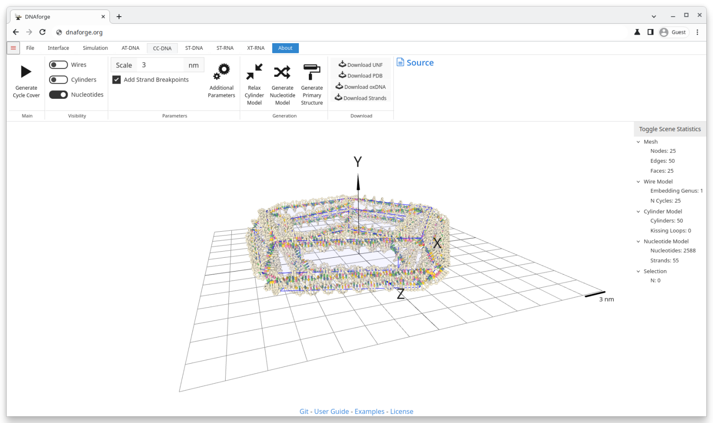
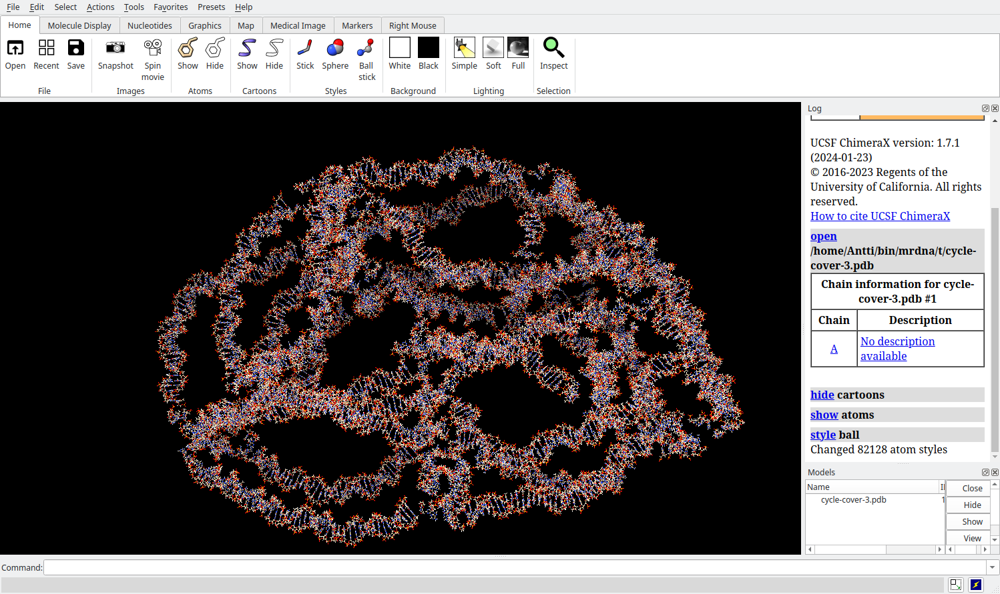

# Cycle Cover 5x5 Torus Example

## Goal
Generate a cycle cover around a mesh based on the procedure described by Wang et al. Also simulate the resulting DNA structure externally with MrDNA using ARBD simulation engine.

>Wang, W. et al. Complex wireframe DNA nanostructures from simple building blocks. Nature Communications 10, 1067 (2019). DOI: https://doi.org/10.1038/s41467-019-08647-7
>ARBD: https://doi.org/10.1016/j.bpj.2012.04.009, https://doi.org/10.1021/jp210641j, https://doi.org/10.1039/C1LC20697D
>MrDNA: https://doi.org/10.1093/nar/gkaa200

## Files
* 5x5_torus.obj

## Steps
1. Import the obj-file.
    * Click Open in the file-tab and select 5x5_torus.obj.
    * **Or** Simply drag and drop the 5x5.obj into the 3D viewport.
2. Navigate to the Cycle Cover context by clicking the Cycle Cover tab.
3. Choose an appropriate scale for the structure.
    * 3nm is a good scale.
4. Optionally, relax the structure by clicking Relax Cylinder Model.
    * Relaxing here makes it easier for the simulation to start.
5. Generate the primary structure by clicking Generate Primary Structure
    * Optionally, click additional settings to change the behaviour of the primary generator.
    * For instance, set all spacer nucleotides to A's by deleting the default W and by typing A and pressing enter.
    * You might also want to allow or ban certain subsequences. For instance, type GGG and press enter to prevent the primary sequence from containing 3 G's in a row.
    * Finish by clicking Generate Primary Structure
6. Click "Download PDB" to download the structure in the PDB fileformat.
    * Save the pdb file on your local filesystem.
7. Navigate to the pdb file and launch MrDNA.
    * Make sure both MrDNA and ARBD are installed.
    * Launch MrDNA from the terminal by typing "python mrdna cycle-cover.pdb -d output"
    * Once the simulation is finished, the resulting pdb-file can be visualised with, e.g., UCSF ChimeraX or PyMOL.
