# Interface walkthrough

## Goal
A step-by-step walkthrough of DNAforge.

## Steps
DNAforge landing page. Click the Example button to open a dialog for example obj-files.
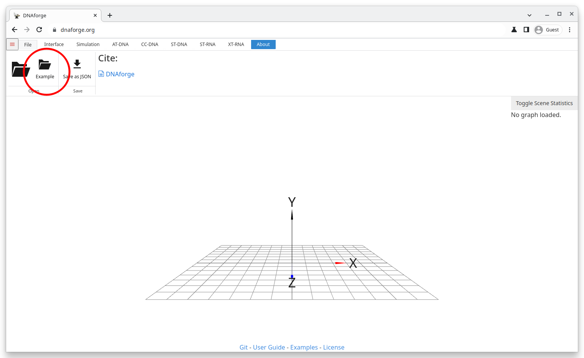

The example file dialog. Select the tetrahedron and click open to import the tetrahedron obj-file into DNAforge.

Tetrahedron in the viewport. Click AT-DNA to switch to the AT-DNA context and to generate an A-trail-routed DNA structure.
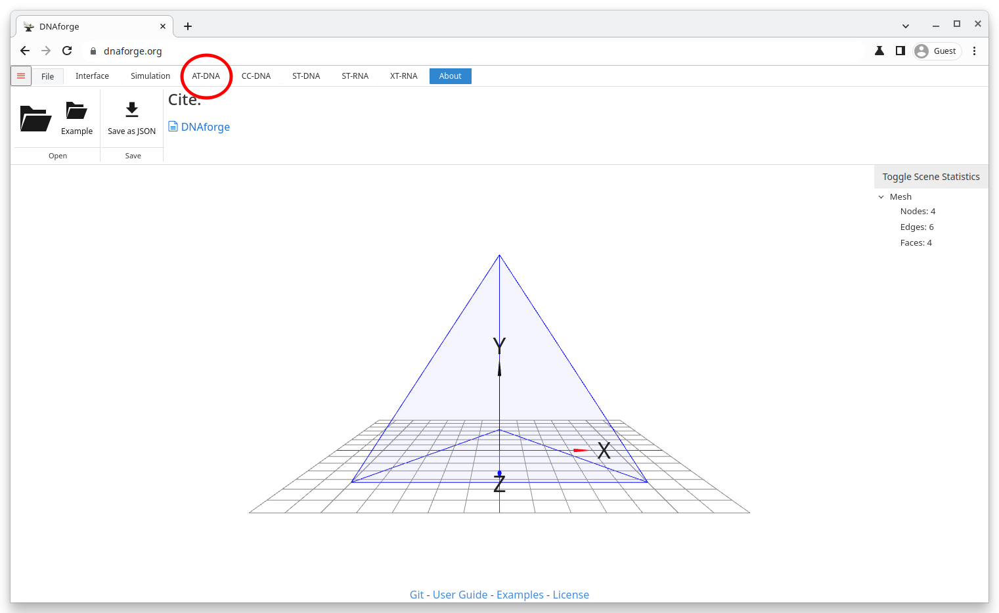

The AT-DNA context. Click the Generate Route button to find an A-trail route around the tetrahedron and to generate a corresponding DNA structure. Note the error message, which indicates that the generation failed. In this case, it happened because the maximum strand length was exceeded due to the staple strands being too long. This error can be rectified in two ways: Either lower the scale to make the structure smaller, or disable midpoint-nicking in the Additional Parameters to allow DNAforge to generate multiple strand gaps per edge.
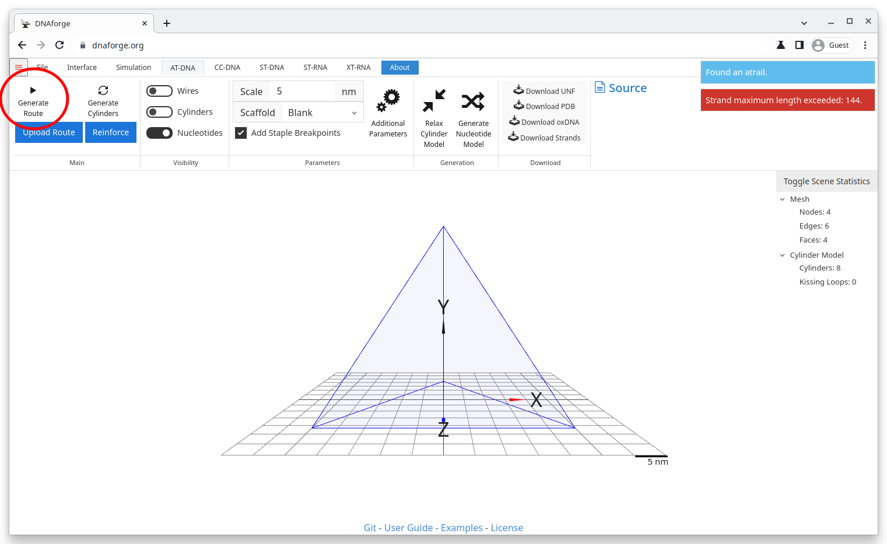

Set the scale to 2 and regenerate the structure. This time everything works out.
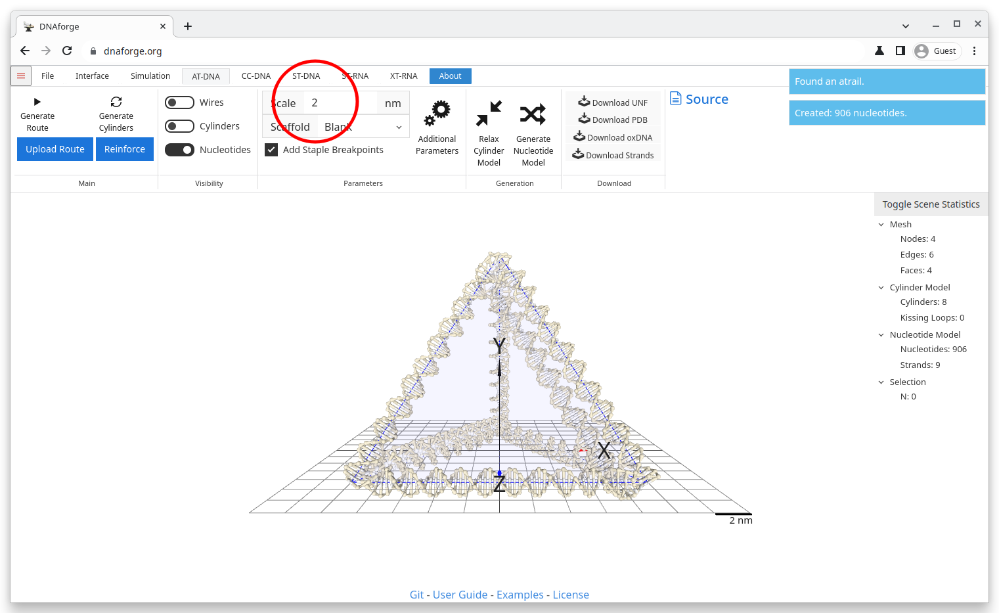

The cylinder model can be visualised by checking the Cylinders-switch. Deselecting the Nucleotides-switch hides the nucleotide model and makes the viewport cleaner.
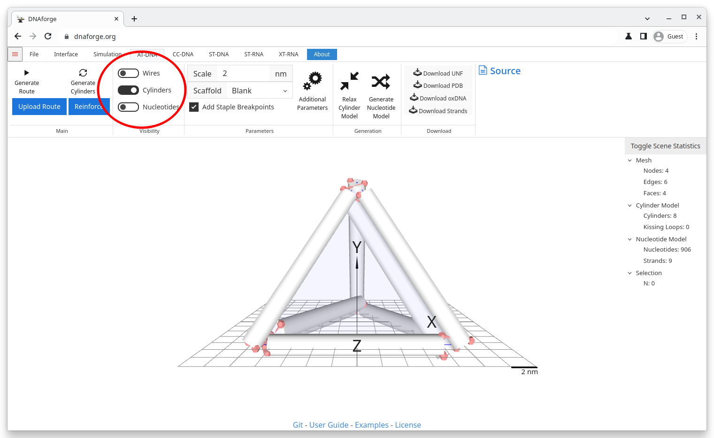

Click Relax Cylinder Model to minimise the lengths of linker segments.
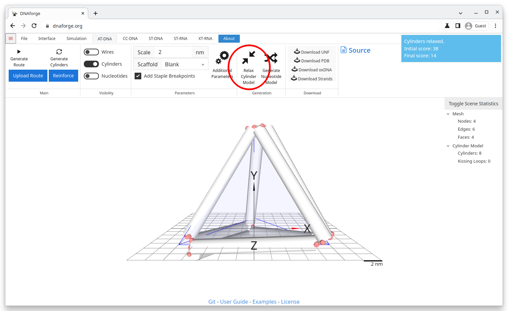

Note that you can select cylinders and perform simple edit operations on them. Click S on the keyboard to scale the cylinder down. They can also be rotated with R or moved with G.
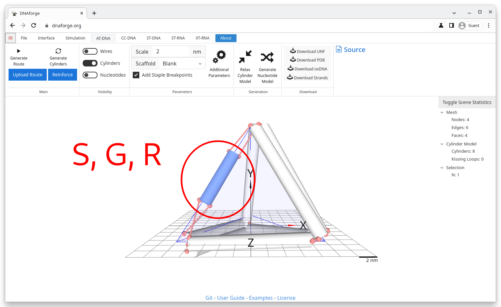

Relax the structure again with the new cylinder model.
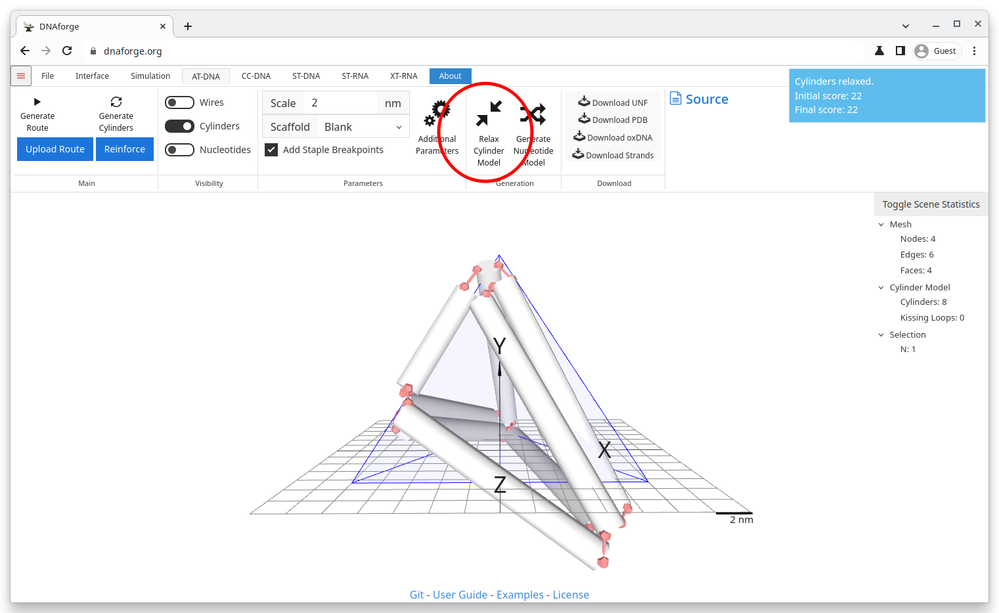

Switch back to the nucleotide display by checking the Nucleotides-switch and unchecking the Cylinders-switch. Pick a scaffold strand to generate a primary sequence for the DNA tetrahedron. Click the Generate Nucleotide Model to assign the chosen scaffold to the design.
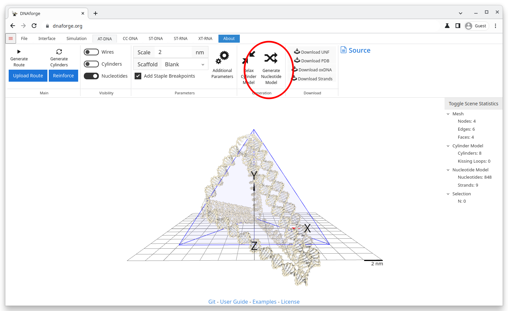

In this case, we accidentally clicked Generate Route instead, and DNAforge created the design from scratch. Press Ctrl+Z on your keyboard to revert this change, and click the correct button next.
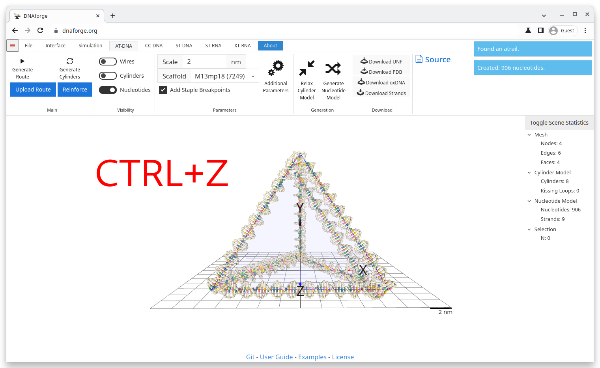

Now that the design is finished, click Donwload PDB button to download the design as a PDB file.
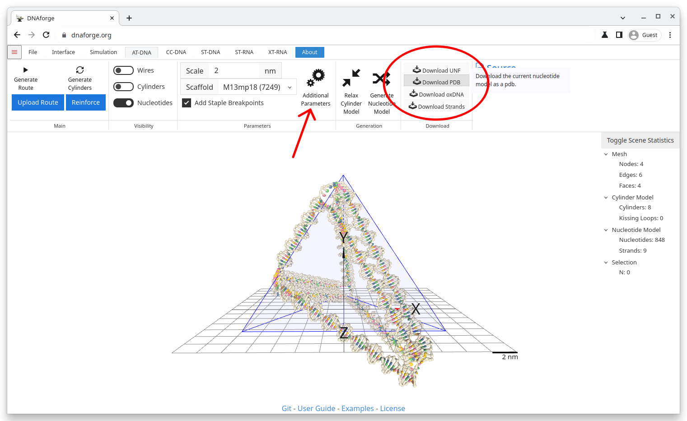

In case you wish to try something else, click Additional Parameters, and change the settings. In this case, we have disabled the Midpoint nicking switch, which would allow DNAforge to add strand gaps to even very large structures in a way that still keeps the staple strands short enough.
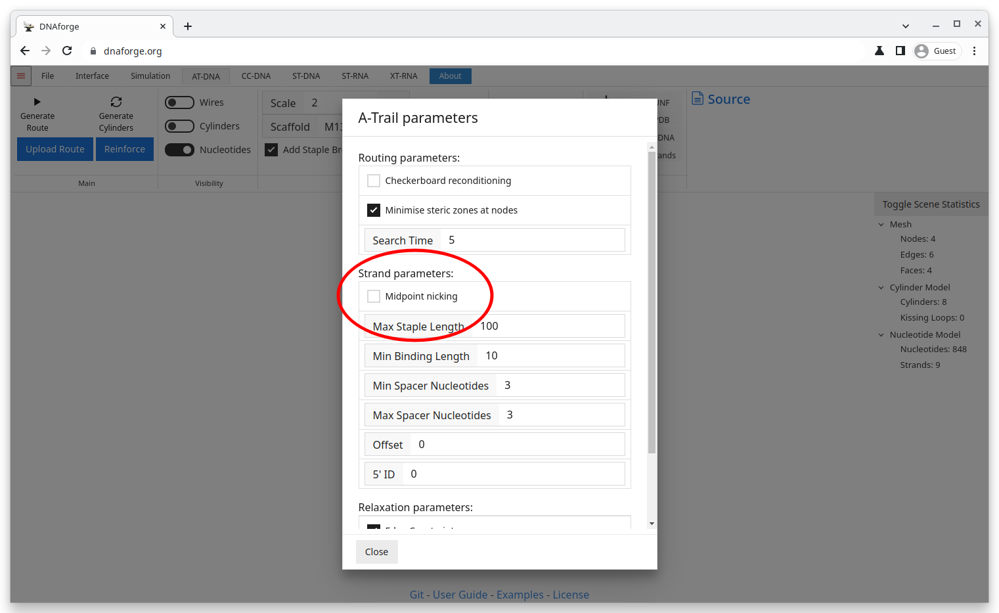

The visuals of DNAforge can be changed from the Interface tab. Click Axes, Grid, Solid, and Wireframe to hide all the clutter.
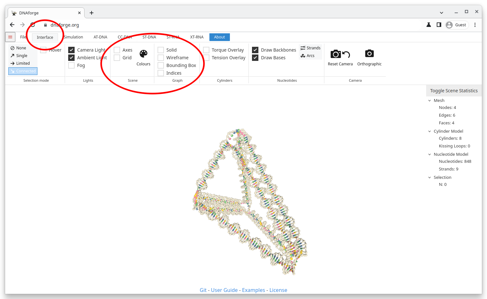

Click Colours to open the colour management window. Add new strand colours by clicking the +-sign. Now each strand has its own colour, which makes the structure easier to visualise.

Other design methods are just as simple to use. Click the ST-RNA tab to swithc to the ST-RNA context and to create a Sterna-routed RNA structure. Click the Generate route button the generate it.
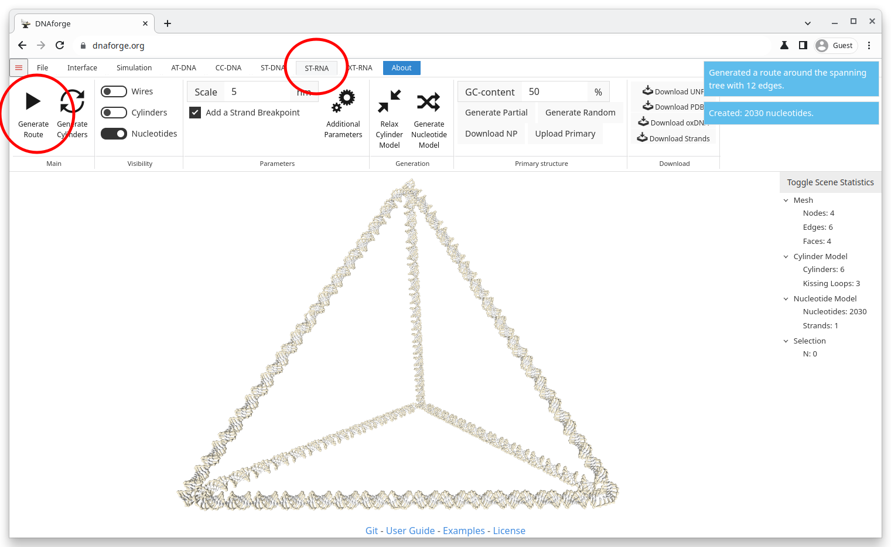

Go back to the Interface tab, and click the Arcs-button to see an arc diagram representation of the ST-RNA design.
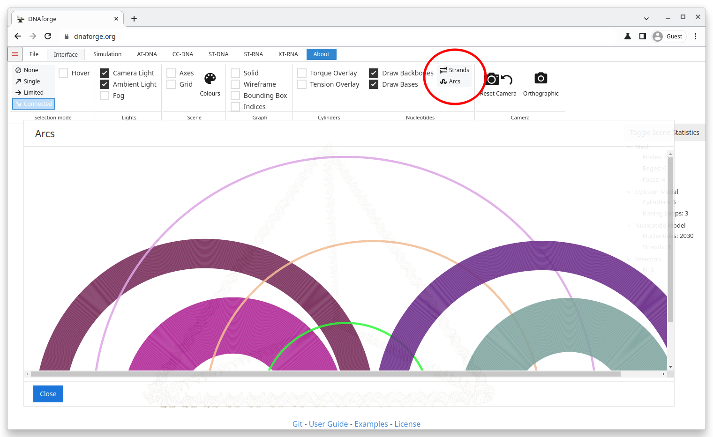

If DNAforge is still confusing, feel free to experiment with buttons and switches, or check out the User Guide or Examples by clicking the links at the bottom of the screen.
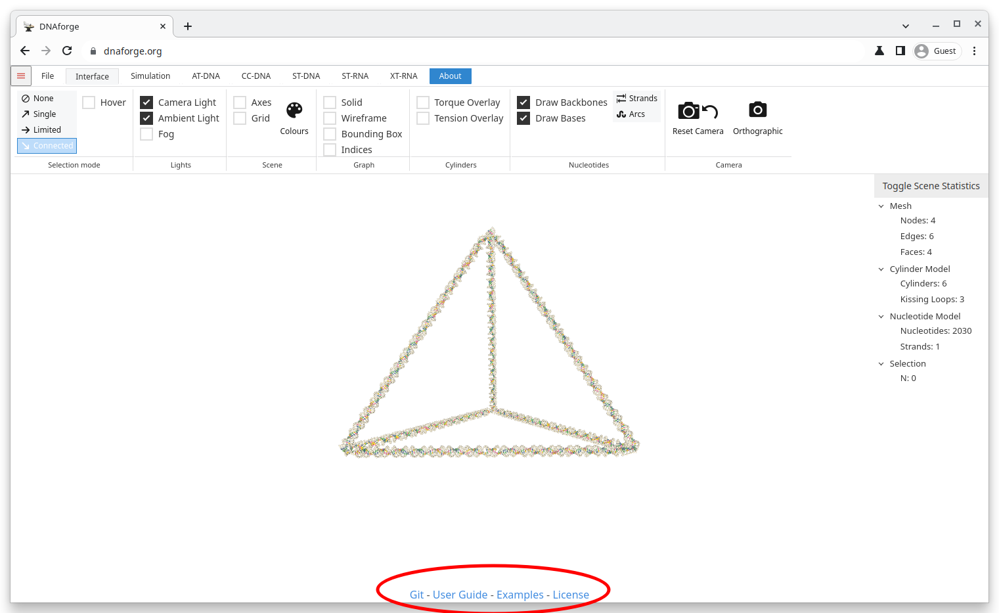

