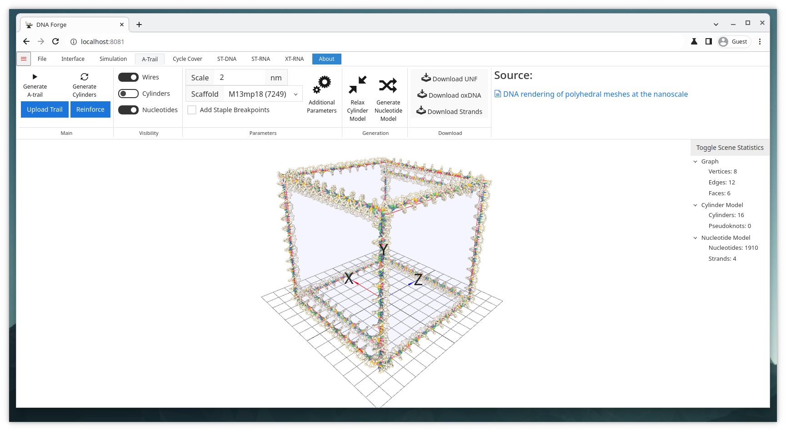

# A-Trail Cube Example

## Goal
Generate an A-trail around a cube based on the procedure described by Benson et al.

> Benson, E. et al. DNA rendering of polyhedral meshes at the nanoscale. Nature 523, 441-444 (2015). DOI: https://doi.org/10.1038/nature14586

## Files
* cube.obj

## Steps
1. Import the obj-file.
    * Click Open in the file-tab and select cube.obj.
    * **Or** Simply drag and drop the cube.obj into the 3D viewport.
2. Navigate to the A-trail context by clicking the A-Trail tab.
3. Choose an appropriate scale for the structure.
    * 2nm is a good scale, but it could also be slightly smaller.
    * 1nm is too small and would require tweaking additional parameters to make work.
4. Select appropriate scaffold strand from the dropdown menu.
    * As long as the scale is reasonably small, any of the scaffolds is long enough.
    * If the scaffold is too short, however, you can select Random or Custom
5. Click Generate A-Trail
    * The cube is now finished and ready for simulation or export.
    * Optionally, the cylinder model can be relaxed by clicking Relax Cylinder Model.

