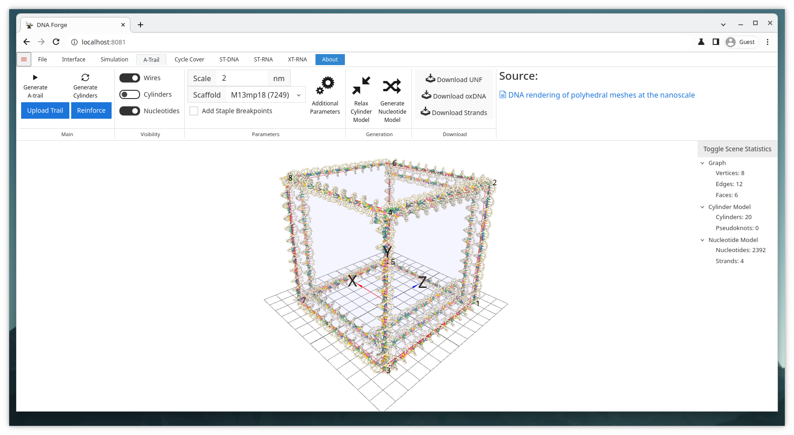

# A-Trail Cube Custom Route Example

## Goal
Generate a custom route around a cube. This is used for bringing an externally generated routing into DNAforge.

## Files
* cube.obj

## Steps
1. Import the obj-file.
    * Click Open in the file-tab and select cube.obj.
    * **Or** Simply drag and drop the cube.obj into the 3D viewport.
2. Navigate to the Interface context by clicking the Interface tab.
    * Set vertex indices visible by clicking the Indices checkbox under the graph subsection
3. Navigate to the A-trail context by clicking the A-Trail tab.
4. Choose an appropriate scale for the structure.
    * 2nm is a good scale.
5. Select appropriate scaffold strand from the dropdown menu.
    * As long as the scale is reasonably small, any of the scaffolds is long enough.
    * If the scaffold is too short, however, you can select Random or Custom
6. Click Upload Trail
    * Input a sequence of vertices. To retain the original structure, this sequence should visit all edges at least once
    * 1 3 7 5 1 2 4 3 1 3 7 8 6 2 4 8 7 5 6 2 1 is one possible route.
    * Click Set Trail
7 Optionally, the cylinder model can be relaxed by clicking Relax Cylinder Model.
