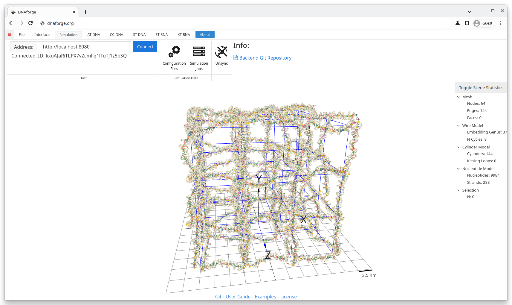

# Cycle Cover 4x4 Lattice Example

## Goal
Generate a cycle cover around a general mesh based on the procedure described by Wang et al. Also simulate the resulting DNA structure with oxDNA directly through DNAforge.

> Wang, W. et al. Complex wireframe DNA nanostructures from simple building blocks. Nature Communications 10, 1067 (2019). DOI: https://doi.org/10.1038/s41467-019-08647-7

## Files
* 4x4.obj

## Steps
1. Import the obj-file.
    * Click Open in the file-tab and select 4x4.obj.
    * **Or** Simply drag and drop the 4x4.obj into the 3D viewport.
2. Navigate to the Cycle Cover context by clicking the Cycle Cover tab.
3. Choose an appropriate scale for the structure.
    * 3.5nm is a good scale, but it could also be slightly smaller.
    * 2nm is too small and would require tweaking additional parameters to make work.
4. Optionally, relax the structure by clicking Relax Cylinder Model.
    * Relaxing here makes it easier for the oxDNA simulation to start.
5. Generate the primary structure by clicking Generate Primary Structure
    * Optionally, click additional settings to change the behaviour of the primary generator.
    * For instance, set all spacer nucleotides to A's by deleting the default W and by typing A and pressing enter.
    * You might also want to allow or ban certain subsequences. For instance, type GGG and press enter to prevent the primary sequence from containing 3 G's in a row.
    * Finish by clicking Generate Primary Structure
6. Navigate to the Simulation tab by clicking the Simulation tab.
7. Connect to the backend by clicking the Connect button.
8. Open the configuration files menu by clicking the Configuration Files button.
    * The default settings should work well, but you might want to, for instance, increase the number of simulation steps or decrease the print interval.
    * To do this, open the Simulation Stage configuration file and change the values to suit your needs.
    * Close the menu.
9. Open the simulation jobs menu by clicking Simulation Jobs
    * Optionally, give the simulation a name and a description.
    * Click New Simulation.
    * Optionally, click the the 3D-button to sync the simulation with the viewport and to see the simulation in real time.
    * Wait for the simulation to finish.
    * Optionally, download the simulation files by clicking the Download button, or, if the simulation is synced with DNAforge, use the default exports in the ST-RNA tab.

