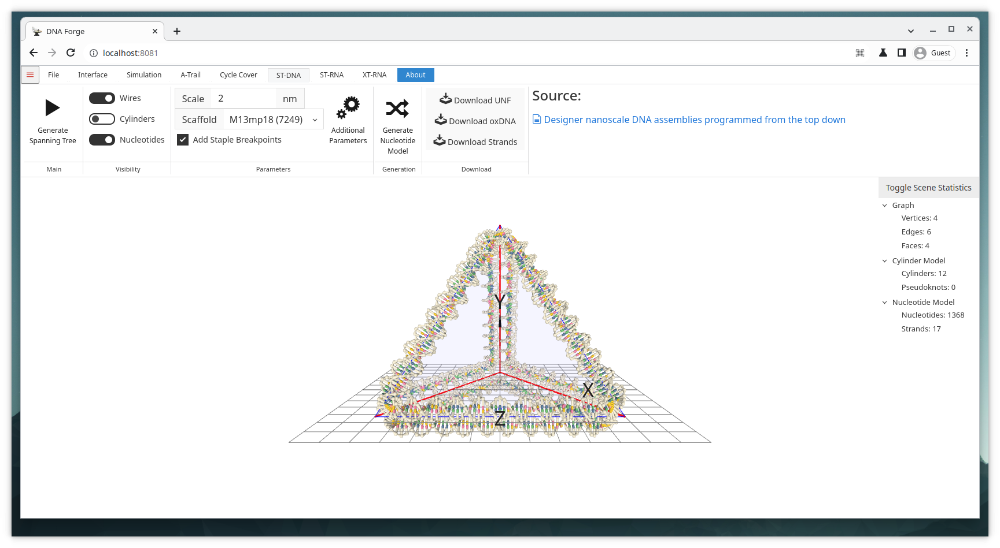

# ST-DNA Tetrahedron Example

## Goal
Generate a DNA structure around the spanning tree of a mesh based on the procedure described by Veneziano et al.

> Veneziano, R. et al. Designer nanoscale DNA assemblies programmed from the top down. Science 352, 1534-1534 (2016). DOI: https://doi.org/10.1126/science.aaf4388

## Files
* tetrahedron.obj

## Steps
1. Import the obj-file.
    * Click Open in the file-tab and select tetrahedron.obj.
    * **Or** Simply drag and drop the tetrahedron.obj into the 3D viewport.
2. Navigate to the ST-DNA context by clicking the ST-DNA tab.
3. Choose an appropriate scale for the structure.
    * 2nm is a good scale.
4. Select appropriate scaffold strand from the dropdown menu.
    * As long as the scale is reasonably small, any of the scaffolds is long enough.
    * If the scaffold is too short, however, you can select Random or Custom
5. Click Generate Spanning Tree
    * The tetrahedron is now finished and ready for simulation or export.
