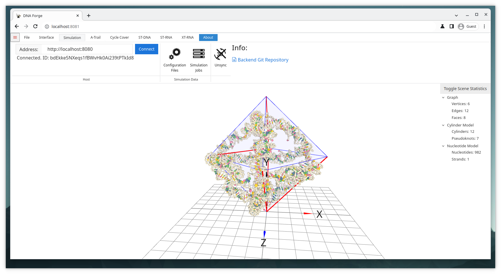

# ST-RNA Octahedron Simulation Example

## Goal
Generate a single-stranded RNA structure around a general mesh based on the procedure described by Elonen et al. Also simulate the resulting RNA structure with oxDNA directly through DNAforge.

> Elonen, A. et al. Algorithmic design of 3D wireframe RNA polyhedra. ACS Nano 16, 16608-16616 (2022). DOI: https://doi.org/10.1021/acsnano.2c06035

## Files
* octahedron.obj

## Prerequisites
Make sure the DNAforge backend is installed and running. The simulation backend and its installation instructions can be found [here](https://github.com/dnaforge/dnaforge-backend).

## Steps
1. Import the obj-file.
    * Click Open in the file-tab and select octahedron.obj.
    * **Or** Simply drag and drop the octahedron.obj into the 3D viewport.
2. Navigate to the ST-RNA context by clicking the ST-RNA tab.
3. Choose an appropriate scale for the structure.
    * 2nm is a good scale, but it could also be slightly smaller.
    * 1nm is too small and would prevent kissing loops from forming.
4. Relax the cylinder model by clicking Relax Cylinder Model
    * Relaxing here makes it easier for the oxDNA simulation to start.
5. Generate the primary structure.
    * Click Generate Partial to generate the primary structure for kissing loops, linkers, and to insert GU-pairs in the double helices.
    * Click Generate Random to generate to fully generate the rest of the primary structure. **Or** Click Download NP to generate the primary structure externally. It can then be uploaded by clicking Upload Primary.
6. Navigate to the Simulation tab by clicking the Simulation tab.
7. Connect to the backend by clicking the Connect button.
8. Open the configuration files menu by clicking the Configuration Files button.
    * By default these settings are for DNA, but the structure we've generated is RNA, so we need to tweak the parameters.
    * Open each configuration file and change the Nucleic Acid type to RNA.
    * Close the configuration files menu.
9. Open the simulation jobs menu by clicking Simulation Jobs
    * Optionally give the simulation a name and a description.
    * Click New Simulation.
    * Optionally click the the 3D-button to sync the simulation with the viewport and to see the simulation in real time.
    * Wait for the simulation to finish.
    * Optionally download the simulation files by clicking the Download button, or, if the simulation is synced with DNAforge, use the default exports in the ST-RNA tab.
