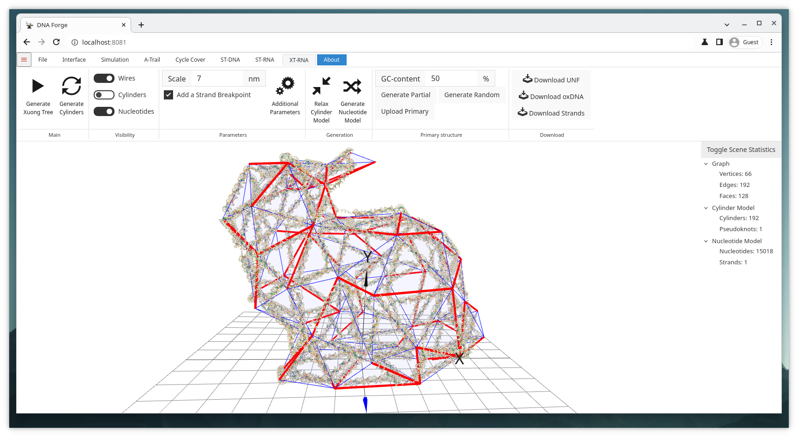

# XT-RNA Bunny Example

## Goal
Generate a single stranded RNA structure around a general mesh with as few kissing loops as possible.

> TBD

## Files
* bunny.obj

## Steps
1. Import the obj-file.
    * Click Open in the file-tab and select bunny.obj.
    * **Or** Simply drag and drop the bunny.obj into the 3D viewport.
2. Navigate to the XT-RNA context by clicking the XT-RNA tab.
3. Choose an appropriate scale for the structure.
    * 7nm is a good scale, but it could also be slightly smaller.
    * As low as 5nm might work, but some double helices would be extremely short
4. Generate the structure by clicking Generate Xuong Tree
    * Optionally, relax the structure by clicking Relax Cylinder Model
5. Generate the primary structure.
    * Click Generate Random to generate a random primary structure.
